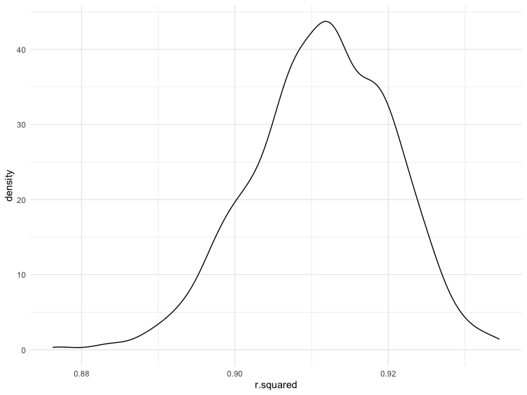
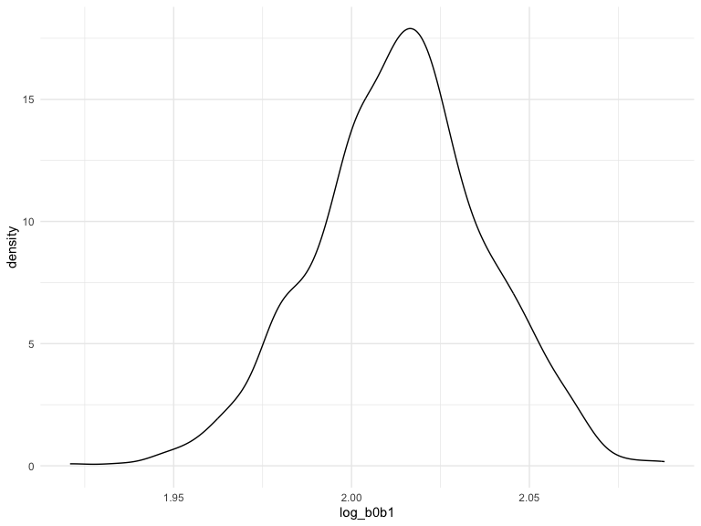
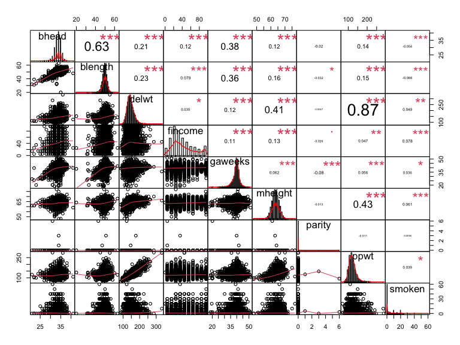
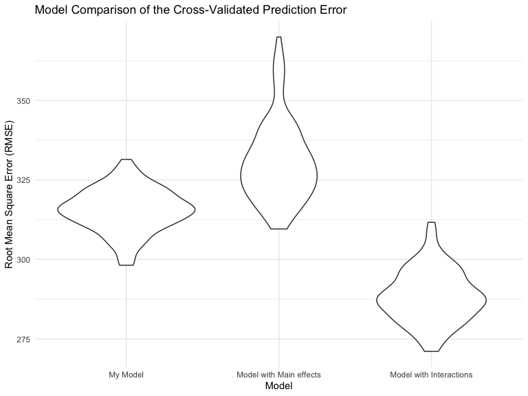

p8105_hw6_yj2687
================
Yijia Jiang
2022-12-03

## Problem 1 (2017 Central Park Weather Dataset)

``` r
# Import the dataset
weather_df = 
  rnoaa::meteo_pull_monitors(
    c("USW00094728"),
    var = c("PRCP", "TMIN", "TMAX"), 
    date_min = "2017-01-01",
    date_max = "2017-12-31") %>%
  mutate(
    name = recode(id, USW00094728 = "CentralPark_NY"),
    tmin = tmin / 10,
    tmax = tmax / 10) %>%
  select(name, id, everything())
```

To obtain a distribution for $\hat{r}^2$, we’ll follow basically the
same procedure we used for regression coefficients: draw bootstrap
samples; the a model to each; extract the value I’m concerned with; and
summarize. Here, we’ll use `modelr::bootstrap` to draw the samples and
`broom::glance` to produce `r.squared` values.

``` r
weather_df %>% 
  modelr::bootstrap(n = 1000) %>% 
  mutate(
    models = map(strap, ~lm(tmax ~ tmin, data = .x) ),
    results = map(models, broom::glance)) %>% 
  select(-strap, -models) %>% 
  unnest(results) %>% 
  ggplot(aes(x = r.squared)) + geom_density()
```



The $\hat{r}^2$ value is high, and the upper bound at 1 may be a cause
for the generally skewed shape of the distribution. If we wanted to
construct a confidence interval for $r^2$, we could take the 2.5% and
97.5% quantiles of the estimates across bootstrap samples. However,
because the shape isn’t symmetric, using the mean +/- 1.96 times the
standard error probably wouldn’t work well.

We can produce a distribution for $\log(\beta_0 * \beta1)$ using a
similar approach, with a bit more wrangling before we make our plot.

``` r
weather_df %>% 
  modelr::bootstrap(n = 1000) %>% 
  mutate(
    models = map(strap, ~lm(tmax ~ tmin, data = .x) ),
    results = map(models, broom::tidy)) %>% 
  select(-strap, -models) %>% 
  unnest(results) %>% 
  select(id = `.id`, term, estimate) %>% 
  pivot_wider(
    names_from = term, 
    values_from = estimate) %>% 
  rename(beta0 = `(Intercept)`, beta1 = tmin) %>% 
  mutate(log_b0b1 = log(beta0 * beta1)) %>% 
  ggplot(aes(x = log_b0b1)) + geom_density()
```



As with $r^2$, this distribution is somewhat skewed and has some
outliers.

The point of this is not to say you should always use the bootstrap –
it’s possible to establish “large sample” distributions for strange
parameters / values / summaries in a lot of cases, and those are great
to have. But it is helpful to know that there’s a way to do inference
even in tough cases.

 

## Problem 2 (Homicide Dataset)

``` r
# Import the dataset
homicide_url = "https://raw.githubusercontent.com/washingtonpost/data-homicides/master/homicide-data.csv"
homicide_raw = read_csv(url(homicide_url)) 

# Clean dataset
# Create variables city_state, resolved;
# Omit cities without victim race reports and error city;
# Limit victim_race to white or black
homicide_df = homicide_raw %>% 
  janitor::clean_names() %>% 
  mutate(reported_date = as.Date(as.character(reported_date), format = "%Y%m%d"),
         victim_age = as.numeric(victim_age),
         victim_race = fct_relevel(victim_race, "White"),
         victim_sex = fct_relevel(victim_sex, "Female"),
         state = toupper(state),
         city_state = str_c(city, state, sep = ", "),
         resolved = as.numeric(disposition == "Closed by arrest")) %>% 
  filter(!city_state %in% c("Dallas, TX","Phoenix, AZ","Kansas City, MO","Tulsa, AL"),
         victim_race %in% c("White","Black")) %>% 
  relocate(city_state) 
```

``` r
#  For the city of Baltimore, MD, fit a logistic regression with resolved vs unresolved as the outcome and victim age, sex and race as predictors.
baltimore_logistic = homicide_df %>%
    filter(city_state == "Baltimore, MD") %>% 
    glm(resolved ~ victim_age + victim_race + victim_sex, data = ., family = binomial(link = "logit")) 

# Obtain the estimate and CI of the adjusted odds ratio for solving homicides
baltimore_logistic_summary = baltimore_logistic %>% 
  broom::tidy(conf.int = T) %>% 
  mutate(OR = exp(estimate),
         CI_lower = exp(conf.low),
         CI_upper = exp(conf.high)) %>% 
  select(term, OR, CI_lower,CI_upper)

baltimore_logistic_summary
```

    ## # A tibble: 4 × 4
    ##   term                OR CI_lower CI_upper
    ##   <chr>            <dbl>    <dbl>    <dbl>
    ## 1 (Intercept)      3.16     2.00     5.06 
    ## 2 victim_age       0.993    0.987    1.00 
    ## 3 victim_raceBlack 0.431    0.305    0.606
    ## 4 victim_sexMale   0.426    0.324    0.558

``` r
# Comparing male victims to female victims keeping all other variables fixed
baltimore_logistic_summary %>% 
  filter(term == "victim_sexMale") %>%
  mutate(term = str_replace(term, "victim_sex", "Victim Sex: ")) %>% 
  knitr::kable(digits = 3, align = "lccc", 
               col.names = c("Term", "Estimated adjusted OR", "Lower bound of 95%CI", "Upper bound of 95%CI"))
```

| Term             | Estimated adjusted OR | Lower bound of 95%CI | Upper bound of 95%CI |
|:-----------------|:---------------------:|:--------------------:|:--------------------:|
| Victim Sex: Male |         0.426         |        0.324         |        0.558         |

-   For the city of Baltimore, MD, controlling for all other variables,
    the homicides whose victim is male are significantly less like to be
    resolved than those whose victim is female.

``` r
# For all the cities, extract the adjusted odds ratio (and CI) for solving homicides comparing male victims to female victims
allcities_logistic = homicide_df %>% 
  nest(data = -city_state) %>% 
  mutate(
    models = map(data, ~glm(resolved ~ victim_age + victim_race + victim_sex, data = ., family = binomial(link = "logit"))),
    results = map(models, ~broom::tidy(.x, conf.int = T))) %>% 
  select(city_state, results) %>% 
  unnest(results) %>% 
  mutate(
    OR = exp(estimate),
    CI_lower = exp(conf.low),
    CI_upper = exp(conf.high),
  ) %>% 
  filter(term == "victim_sexMale") %>% 
  select(city_state, OR, CI_lower,CI_upper) 

allcities_logistic %>% 
  knitr::kable(digits = 3, align = "llccc", col.names = c("City", "Estimated adjusted OR", "CI lower bound", "CI upper bound"))
```

| City               | Estimated adjusted OR | CI lower bound | CI upper bound |
|:-------------------|:----------------------|:--------------:|:--------------:|
| Albuquerque, NM    | 1.767                 |     0.825      |     3.762      |
| Atlanta, GA        | 1.000                 |     0.680      |     1.458      |
| Baltimore, MD      | 0.426                 |     0.324      |     0.558      |
| Baton Rouge, LA    | 0.381                 |     0.204      |     0.684      |
| Birmingham, AL     | 0.870                 |     0.571      |     1.314      |
| Boston, MA         | 0.674                 |     0.353      |     1.277      |
| Buffalo, NY        | 0.521                 |     0.288      |     0.936      |
| Charlotte, NC      | 0.884                 |     0.551      |     1.391      |
| Chicago, IL        | 0.410                 |     0.336      |     0.501      |
| Cincinnati, OH     | 0.400                 |     0.231      |     0.667      |
| Columbus, OH       | 0.532                 |     0.377      |     0.748      |
| Denver, CO         | 0.479                 |     0.233      |     0.962      |
| Detroit, MI        | 0.582                 |     0.462      |     0.734      |
| Durham, NC         | 0.812                 |     0.382      |     1.658      |
| Fort Worth, TX     | 0.669                 |     0.394      |     1.121      |
| Fresno, CA         | 1.335                 |     0.567      |     3.048      |
| Houston, TX        | 0.711                 |     0.557      |     0.906      |
| Indianapolis, IN   | 0.919                 |     0.678      |     1.241      |
| Jacksonville, FL   | 0.720                 |     0.536      |     0.965      |
| Las Vegas, NV      | 0.837                 |     0.606      |     1.151      |
| Long Beach, CA     | 0.410                 |     0.143      |     1.024      |
| Los Angeles, CA    | 0.662                 |     0.457      |     0.954      |
| Louisville, KY     | 0.491                 |     0.301      |     0.784      |
| Memphis, TN        | 0.723                 |     0.526      |     0.984      |
| Miami, FL          | 0.515                 |     0.304      |     0.873      |
| Milwaukee, WI      | 0.727                 |     0.495      |     1.054      |
| Minneapolis, MN    | 0.947                 |     0.476      |     1.881      |
| Nashville, TN      | 1.034                 |     0.681      |     1.556      |
| New Orleans, LA    | 0.585                 |     0.422      |     0.812      |
| New York, NY       | 0.262                 |     0.133      |     0.485      |
| Oakland, CA        | 0.563                 |     0.364      |     0.867      |
| Oklahoma City, OK  | 0.974                 |     0.623      |     1.520      |
| Omaha, NE          | 0.382                 |     0.199      |     0.711      |
| Philadelphia, PA   | 0.496                 |     0.376      |     0.650      |
| Pittsburgh, PA     | 0.431                 |     0.263      |     0.696      |
| Richmond, VA       | 1.006                 |     0.483      |     1.994      |
| San Antonio, TX    | 0.705                 |     0.393      |     1.238      |
| Sacramento, CA     | 0.669                 |     0.326      |     1.314      |
| Savannah, GA       | 0.867                 |     0.419      |     1.780      |
| San Bernardino, CA | 0.500                 |     0.166      |     1.462      |
| San Diego, CA      | 0.413                 |     0.191      |     0.830      |
| San Francisco, CA  | 0.608                 |     0.312      |     1.155      |
| St. Louis, MO      | 0.703                 |     0.530      |     0.932      |
| Stockton, CA       | 1.352                 |     0.626      |     2.994      |
| Tampa, FL          | 0.808                 |     0.340      |     1.860      |
| Tulsa, OK          | 0.976                 |     0.609      |     1.544      |
| Washington, DC     | 0.690                 |     0.465      |     1.012      |

``` r
# Create a plot showing the estimated ORs and CIs for each city
allcities_logistic %>% 
  mutate(city_state = fct_reorder(city_state, OR)) %>%
  ggplot(aes(x = city_state, y = OR)) +
  geom_point() +
  geom_errorbar(aes(ymin = CI_lower, ymax = CI_upper)) +
  theme(axis.text.x = element_text(angle = 90, vjust = 0.5, hjust = 1), plot.title = element_text(size = 12)) +
  labs(x = "City", y = "Estimated OR with CI",
       title = "Estimated Odds Ratios and CIs for Solving Homicides Comparing Male to Female Victims")
```


-    

## Problem 3 (Child’s birthweight Dataset)

``` r
# Import the dataset
birthweight_raw <- read_csv("./p8105_hw6_data/birthweight.csv")

# Tidy the dataset
birthweight_df = birthweight_raw %>% 
  janitor::clean_names() %>%
  mutate(across(.cols = c(babysex, malform, frace, mrace), as.factor))

# Check for NA
map(birthweight_df, ~sum(is.na(.)))
```

    ## $babysex
    ## [1] 0
    ## 
    ## $bhead
    ## [1] 0
    ## 
    ## $blength
    ## [1] 0
    ## 
    ## $bwt
    ## [1] 0
    ## 
    ## $delwt
    ## [1] 0
    ## 
    ## $fincome
    ## [1] 0
    ## 
    ## $frace
    ## [1] 0
    ## 
    ## $gaweeks
    ## [1] 0
    ## 
    ## $malform
    ## [1] 0
    ## 
    ## $menarche
    ## [1] 0
    ## 
    ## $mheight
    ## [1] 0
    ## 
    ## $momage
    ## [1] 0
    ## 
    ## $mrace
    ## [1] 0
    ## 
    ## $parity
    ## [1] 0
    ## 
    ## $pnumlbw
    ## [1] 0
    ## 
    ## $pnumsga
    ## [1] 0
    ## 
    ## $ppbmi
    ## [1] 0
    ## 
    ## $ppwt
    ## [1] 0
    ## 
    ## $smoken
    ## [1] 0
    ## 
    ## $wtgain
    ## [1] 0

``` r
# Dataset summary
skimr::skim(birthweight_df)
```

|                                                  |                |
|:-------------------------------------------------|:---------------|
| Name                                             | birthweight_df |
| Number of rows                                   | 4342           |
| Number of columns                                | 20             |
| \_\_\_\_\_\_\_\_\_\_\_\_\_\_\_\_\_\_\_\_\_\_\_   |                |
| Column type frequency:                           |                |
| factor                                           | 4              |
| numeric                                          | 16             |
| \_\_\_\_\_\_\_\_\_\_\_\_\_\_\_\_\_\_\_\_\_\_\_\_ |                |
| Group variables                                  | None           |

Data summary

**Variable type: factor**

| skim_variable | n_missing | complete_rate | ordered | n_unique | top_counts                      |
|:--------------|----------:|--------------:|:--------|---------:|:--------------------------------|
| babysex       |         0 |             1 | FALSE   |        2 | 1: 2230, 2: 2112                |
| frace         |         0 |             1 | FALSE   |        5 | 1: 2123, 2: 1911, 4: 248, 3: 46 |
| malform       |         0 |             1 | FALSE   |        2 | 0: 4327, 1: 15                  |
| mrace         |         0 |             1 | FALSE   |        4 | 1: 2147, 2: 1909, 4: 243, 3: 43 |

**Variable type: numeric**

| skim_variable | n_missing | complete_rate |    mean |     sd |     p0 |     p25 |     p50 |     p75 |   p100 | hist  |
|:--------------|----------:|--------------:|--------:|-------:|-------:|--------:|--------:|--------:|-------:|:------|
| bhead         |         0 |             1 |   33.65 |   1.62 |  21.00 |   33.00 |   34.00 |   35.00 |   41.0 | ▁▁▆▇▁ |
| blength       |         0 |             1 |   49.75 |   2.72 |  20.00 |   48.00 |   50.00 |   51.00 |   63.0 | ▁▁▁▇▁ |
| bwt           |         0 |             1 | 3114.40 | 512.15 | 595.00 | 2807.00 | 3132.50 | 3459.00 | 4791.0 | ▁▁▇▇▁ |
| delwt         |         0 |             1 |  145.57 |  22.21 |  86.00 |  131.00 |  143.00 |  157.00 |  334.0 | ▅▇▁▁▁ |
| fincome       |         0 |             1 |   44.11 |  25.98 |   0.00 |   25.00 |   35.00 |   65.00 |   96.0 | ▃▇▅▂▃ |
| gaweeks       |         0 |             1 |   39.43 |   3.15 |  17.70 |   38.30 |   39.90 |   41.10 |   51.3 | ▁▁▂▇▁ |
| menarche      |         0 |             1 |   12.51 |   1.48 |   0.00 |   12.00 |   12.00 |   13.00 |   19.0 | ▁▁▂▇▁ |
| mheight       |         0 |             1 |   63.49 |   2.66 |  48.00 |   62.00 |   63.00 |   65.00 |   77.0 | ▁▁▇▂▁ |
| momage        |         0 |             1 |   20.30 |   3.88 |  12.00 |   18.00 |   20.00 |   22.00 |   44.0 | ▅▇▂▁▁ |
| parity        |         0 |             1 |    0.00 |   0.10 |   0.00 |    0.00 |    0.00 |    0.00 |    6.0 | ▇▁▁▁▁ |
| pnumlbw       |         0 |             1 |    0.00 |   0.00 |   0.00 |    0.00 |    0.00 |    0.00 |    0.0 | ▁▁▇▁▁ |
| pnumsga       |         0 |             1 |    0.00 |   0.00 |   0.00 |    0.00 |    0.00 |    0.00 |    0.0 | ▁▁▇▁▁ |
| ppbmi         |         0 |             1 |   21.57 |   3.18 |  13.07 |   19.53 |   21.03 |   22.91 |   46.1 | ▃▇▁▁▁ |
| ppwt          |         0 |             1 |  123.49 |  20.16 |  70.00 |  110.00 |  120.00 |  134.00 |  287.0 | ▅▇▁▁▁ |
| smoken        |         0 |             1 |    4.15 |   7.41 |   0.00 |    0.00 |    0.00 |    5.00 |   60.0 | ▇▁▁▁▁ |
| wtgain        |         0 |             1 |   22.08 |  10.94 | -46.00 |   15.00 |   22.00 |   28.00 |   89.0 | ▁▁▇▁▁ |

-   In the data tidying and wrangling process, I converted the variable
    `babysex`, `malform`, `frace`, and `mrace` into factors as they are
    categorical variables.
-   In our tidied dataset, no missing values was detected in all
    variables.

``` r
# Propose a regression model for birthweight
# Based on a data-driven model-building process
mult.fit = lm(bwt ~ ., data = birthweight_df)
step(mult.fit, direction = "both", k = 2)
```

    ## Start:  AIC=48717.83
    ## bwt ~ babysex + bhead + blength + delwt + fincome + frace + gaweeks + 
    ##     malform + menarche + mheight + momage + mrace + parity + 
    ##     pnumlbw + pnumsga + ppbmi + ppwt + smoken + wtgain
    ## 
    ## 
    ## Step:  AIC=48717.83
    ## bwt ~ babysex + bhead + blength + delwt + fincome + frace + gaweeks + 
    ##     malform + menarche + mheight + momage + mrace + parity + 
    ##     pnumlbw + pnumsga + ppbmi + ppwt + smoken
    ## 
    ## 
    ## Step:  AIC=48717.83
    ## bwt ~ babysex + bhead + blength + delwt + fincome + frace + gaweeks + 
    ##     malform + menarche + mheight + momage + mrace + parity + 
    ##     pnumlbw + ppbmi + ppwt + smoken
    ## 
    ## 
    ## Step:  AIC=48717.83
    ## bwt ~ babysex + bhead + blength + delwt + fincome + frace + gaweeks + 
    ##     malform + menarche + mheight + momage + mrace + parity + 
    ##     ppbmi + ppwt + smoken
    ## 
    ##            Df Sum of Sq       RSS   AIC
    ## - frace     4    124365 320848704 48712
    ## - malform   1      1419 320725757 48716
    ## - ppbmi     1      6346 320730684 48716
    ## - momage    1     28661 320752999 48716
    ## - mheight   1     66886 320791224 48717
    ## - menarche  1    111679 320836018 48717
    ## - ppwt      1    131132 320855470 48718
    ## <none>                  320724338 48718
    ## - fincome   1    193454 320917792 48718
    ## - parity    1    413584 321137922 48721
    ## - mrace     3    868321 321592659 48724
    ## - babysex   1    853796 321578134 48727
    ## - gaweeks   1   4611823 325336161 48778
    ## - smoken    1   5076393 325800732 48784
    ## - delwt     1   8008891 328733230 48823
    ## - blength   1 102050296 422774634 49915
    ## - bhead     1 106535716 427260054 49961
    ## 
    ## Step:  AIC=48711.51
    ## bwt ~ babysex + bhead + blength + delwt + fincome + gaweeks + 
    ##     malform + menarche + mheight + momage + mrace + parity + 
    ##     ppbmi + ppwt + smoken
    ## 
    ##            Df Sum of Sq       RSS   AIC
    ## - malform   1      1447 320850151 48710
    ## - ppbmi     1      6975 320855679 48710
    ## - momage    1     28379 320877083 48710
    ## - mheight   1     69502 320918206 48710
    ## - menarche  1    115708 320964411 48711
    ## - ppwt      1    133961 320982665 48711
    ## <none>                  320848704 48712
    ## - fincome   1    194405 321043108 48712
    ## - parity    1    414687 321263390 48715
    ## + frace     4    124365 320724338 48718
    ## - babysex   1    852133 321700837 48721
    ## - gaweeks   1   4625208 325473911 48772
    ## - smoken    1   5036389 325885093 48777
    ## - delwt     1   8013099 328861802 48817
    ## - mrace     3  13540415 334389119 48885
    ## - blength   1 101995688 422844392 49908
    ## - bhead     1 106662962 427511666 49956
    ## 
    ## Step:  AIC=48709.53
    ## bwt ~ babysex + bhead + blength + delwt + fincome + gaweeks + 
    ##     menarche + mheight + momage + mrace + parity + ppbmi + ppwt + 
    ##     smoken
    ## 
    ##            Df Sum of Sq       RSS   AIC
    ## - ppbmi     1      6928 320857079 48708
    ## - momage    1     28660 320878811 48708
    ## - mheight   1     69320 320919470 48708
    ## - menarche  1    116027 320966177 48709
    ## - ppwt      1    133894 320984044 48709
    ## <none>                  320850151 48710
    ## - fincome   1    193784 321043934 48710
    ## + malform   1      1447 320848704 48712
    ## - parity    1    414482 321264633 48713
    ## + frace     4    124393 320725757 48716
    ## - babysex   1    851279 321701430 48719
    ## - gaweeks   1   4624003 325474154 48770
    ## - smoken    1   5035195 325885346 48775
    ## - delwt     1   8029079 328879230 48815
    ## - mrace     3  13553320 334403471 48883
    ## - blength   1 102009225 422859375 49906
    ## - bhead     1 106675331 427525481 49954
    ## 
    ## Step:  AIC=48707.63
    ## bwt ~ babysex + bhead + blength + delwt + fincome + gaweeks + 
    ##     menarche + mheight + momage + mrace + parity + ppwt + smoken
    ## 
    ##            Df Sum of Sq       RSS   AIC
    ## - momage    1     29211 320886290 48706
    ## - menarche  1    117635 320974714 48707
    ## <none>                  320857079 48708
    ## - fincome   1    195199 321052278 48708
    ## + ppbmi     1      6928 320850151 48710
    ## + malform   1      1400 320855679 48710
    ## - parity    1    412984 321270064 48711
    ## + frace     4    125020 320732060 48714
    ## - babysex   1    850020 321707099 48717
    ## - mheight   1   1078673 321935752 48720
    ## - ppwt      1   2934023 323791103 48745
    ## - gaweeks   1   4621504 325478583 48768
    ## - smoken    1   5039368 325896447 48773
    ## - delwt     1   8024939 328882018 48813
    ## - mrace     3  13551444 334408523 48881
    ## - blength   1 102018559 422875638 49904
    ## - bhead     1 106821342 427678421 49953
    ## 
    ## Step:  AIC=48706.02
    ## bwt ~ babysex + bhead + blength + delwt + fincome + gaweeks + 
    ##     menarche + mheight + mrace + parity + ppwt + smoken
    ## 
    ##            Df Sum of Sq       RSS   AIC
    ## - menarche  1    100121 320986412 48705
    ## <none>                  320886290 48706
    ## - fincome   1    240800 321127090 48707
    ## + momage    1     29211 320857079 48708
    ## + ppbmi     1      7479 320878811 48708
    ## + malform   1      1678 320884612 48708
    ## - parity    1    431433 321317724 48710
    ## + frace     4    124743 320761547 48712
    ## - babysex   1    841278 321727568 48715
    ## - mheight   1   1076739 321963029 48719
    ## - ppwt      1   2913653 323799943 48743
    ## - gaweeks   1   4676469 325562760 48767
    ## - smoken    1   5045104 325931394 48772
    ## - delwt     1   8000672 328886962 48811
    ## - mrace     3  14667730 335554021 48894
    ## - blength   1 101990556 422876847 49902
    ## - bhead     1 106864308 427750598 49952
    ## 
    ## Step:  AIC=48705.38
    ## bwt ~ babysex + bhead + blength + delwt + fincome + gaweeks + 
    ##     mheight + mrace + parity + ppwt + smoken
    ## 
    ##            Df Sum of Sq       RSS   AIC
    ## <none>                  320986412 48705
    ## + menarche  1    100121 320886290 48706
    ## - fincome   1    245637 321232048 48707
    ## + momage    1     11698 320974714 48707
    ## + ppbmi     1      8823 320977589 48707
    ## + malform   1      1884 320984528 48707
    ## - parity    1    422770 321409181 48709
    ## + frace     4    128726 320857686 48712
    ## - babysex   1    846134 321832545 48715
    ## - mheight   1   1012240 321998651 48717
    ## - ppwt      1   2907049 323893461 48743
    ## - gaweeks   1   4662501 325648912 48766
    ## - smoken    1   5073849 326060260 48771
    ## - delwt     1   8137459 329123871 48812
    ## - mrace     3  14683609 335670021 48894
    ## - blength   1 102191779 423178191 49903
    ## - bhead     1 106779754 427766166 49950

    ## 
    ## Call:
    ## lm(formula = bwt ~ babysex + bhead + blength + delwt + fincome + 
    ##     gaweeks + mheight + mrace + parity + ppwt + smoken, data = birthweight_df)
    ## 
    ## Coefficients:
    ## (Intercept)     babysex2        bhead      blength        delwt      fincome  
    ##   -6098.822       28.558      130.777       74.947        4.107        0.318  
    ##     gaweeks      mheight       mrace2       mrace3       mrace4       parity  
    ##      11.592        6.594     -138.792      -74.887     -100.678       96.305  
    ##        ppwt       smoken  
    ##      -2.676       -4.843

-   By using the stepwise regression with Akaike information criterion
    (AIC), it determines objectively the best model as the one that
    minimizes the considered information criterion. The resulting model
    has 11 variables, which are `babysex`, `bhead`, `blength`, `delwt`,
    `fincome`, `gaweeks`, `mheight`, `mrace`, `parity`, `ppwt` and
    `smoken`.

``` r
model_fit1 = lm(bwt ~ babysex + bhead + blength + delwt + fincome + gaweeks + mheight + mrace + parity + ppwt + smoken, data = birthweight_df)
summary(model_fit1)
```

    ## 
    ## Call:
    ## lm(formula = bwt ~ babysex + bhead + blength + delwt + fincome + 
    ##     gaweeks + mheight + mrace + parity + ppwt + smoken, data = birthweight_df)
    ## 
    ## Residuals:
    ##      Min       1Q   Median       3Q      Max 
    ## -1097.18  -185.52    -3.39   174.14  2353.44 
    ## 
    ## Coefficients:
    ##               Estimate Std. Error t value Pr(>|t|)    
    ## (Intercept) -6098.8219   137.5463 -44.340  < 2e-16 ***
    ## babysex2       28.5580     8.4549   3.378 0.000737 ***
    ## bhead         130.7770     3.4466  37.944  < 2e-16 ***
    ## blength        74.9471     2.0190  37.120  < 2e-16 ***
    ## delwt           4.1067     0.3921  10.475  < 2e-16 ***
    ## fincome         0.3180     0.1747   1.820 0.068844 .  
    ## gaweeks        11.5925     1.4621   7.929 2.79e-15 ***
    ## mheight         6.5940     1.7849   3.694 0.000223 ***
    ## mrace2       -138.7925     9.9071 -14.009  < 2e-16 ***
    ## mrace3        -74.8868    42.3146  -1.770 0.076837 .  
    ## mrace4       -100.6781    19.3247  -5.210 1.98e-07 ***
    ## parity         96.3047    40.3362   2.388 0.017004 *  
    ## ppwt           -2.6756     0.4274  -6.261 4.20e-10 ***
    ## smoken         -4.8434     0.5856  -8.271  < 2e-16 ***
    ## ---
    ## Signif. codes:  0 '***' 0.001 '**' 0.01 '*' 0.05 '.' 0.1 ' ' 1
    ## 
    ## Residual standard error: 272.3 on 4328 degrees of freedom
    ## Multiple R-squared:  0.7181, Adjusted R-squared:  0.7173 
    ## F-statistic: 848.1 on 13 and 4328 DF,  p-value: < 2.2e-16

-   After looking at the summary, I found out the p-value of `fincome`
    is greater than 0.05 and hence I am going to drop it.

``` r
# Check correlation between predictors and the selected continuous variables
birthweight_df %>%
  select(bhead, blength, delwt, fincome, gaweeks, mheight, parity, ppwt, smoken) %>% 
  PerformanceAnalytics::chart.Correlation(method = "pearson")
```



-   According to the correlation plot above, we can identify a potential
    collinearity between `delwt` and `ppwt` and between `bhead` and
    `blength`. Therefore, I plan to exclude `ppwt` and `blength` from my
    model, whose p-values are relatively larger in my model.

``` r
# Model after dropping blength, ppwt and fincome
model_fit2 = lm(bwt ~ babysex + bhead + delwt + gaweeks + mheight + mrace + parity + smoken, data = birthweight_df)
summary(model_fit2)
```

    ## 
    ## Call:
    ## lm(formula = bwt ~ babysex + bhead + delwt + gaweeks + mheight + 
    ##     mrace + parity + smoken, data = birthweight_df)
    ## 
    ## Residuals:
    ##      Min       1Q   Median       3Q      Max 
    ## -1116.19  -210.65    -3.58   200.63  2178.92 
    ## 
    ## Coefficients:
    ##               Estimate Std. Error t value Pr(>|t|)    
    ## (Intercept) -5319.5278   156.9839 -33.886  < 2e-16 ***
    ## babysex2       21.2733     9.7599   2.180   0.0293 *  
    ## bhead         199.8843     3.3751  59.224  < 2e-16 ***
    ## delwt           2.7566     0.2423  11.375  < 2e-16 ***
    ## gaweeks        20.8795     1.6628  12.557  < 2e-16 ***
    ## mheight         9.2046     2.0236   4.549 5.55e-06 ***
    ## mrace2       -173.6867    10.6120 -16.367  < 2e-16 ***
    ## mrace3        -71.8091    48.7970  -1.472   0.1412    
    ## mrace4       -129.9751    22.0460  -5.896 4.02e-09 ***
    ## parity         81.4385    46.5536   1.749   0.0803 .  
    ## smoken         -6.6212     0.6734  -9.833  < 2e-16 ***
    ## ---
    ## Signif. codes:  0 '***' 0.001 '**' 0.01 '*' 0.05 '.' 0.1 ' ' 1
    ## 
    ## Residual standard error: 314.5 on 4331 degrees of freedom
    ## Multiple R-squared:  0.6238, Adjusted R-squared:  0.623 
    ## F-statistic: 718.3 on 10 and 4331 DF,  p-value: < 2.2e-16

-   After dropping the three variables `blength`, `ppwt` and `fincome`,
    I rebuild my model and obtain the results that the p-value for
    `parity` is greater than 0.05, which is not signicant at the level
    of 0.05. Thus, I drop this variable too.

``` r
# Model after dropping blength, ppwt, fincome and parity
model_fit3 = lm(bwt ~ babysex + bhead + delwt + gaweeks + mheight + mrace + smoken, data = birthweight_df)
summary(model_fit3)
```

    ## 
    ## Call:
    ## lm(formula = bwt ~ babysex + bhead + delwt + gaweeks + mheight + 
    ##     mrace + smoken, data = birthweight_df)
    ## 
    ## Residuals:
    ##      Min       1Q   Median       3Q      Max 
    ## -1116.93  -210.80    -3.68   201.53  2179.56 
    ## 
    ## Coefficients:
    ##               Estimate Std. Error t value Pr(>|t|)    
    ## (Intercept) -5310.4391   156.9352 -33.838  < 2e-16 ***
    ## babysex2       21.7498     9.7584   2.229   0.0259 *  
    ## bhead         199.9740     3.3755  59.243  < 2e-16 ***
    ## delwt           2.7599     0.2424  11.386  < 2e-16 ***
    ## gaweeks        20.6460     1.6578  12.454  < 2e-16 ***
    ## mheight         9.1518     2.0239   4.522 6.29e-06 ***
    ## mrace2       -173.7660    10.6144 -16.371  < 2e-16 ***
    ## mrace3        -71.9106    48.8086  -1.473   0.1407    
    ## mrace4       -130.4461    22.0496  -5.916 3.55e-09 ***
    ## smoken         -6.6232     0.6735  -9.834  < 2e-16 ***
    ## ---
    ## Signif. codes:  0 '***' 0.001 '**' 0.01 '*' 0.05 '.' 0.1 ' ' 1
    ## 
    ## Residual standard error: 314.5 on 4332 degrees of freedom
    ## Multiple R-squared:  0.6236, Adjusted R-squared:  0.6228 
    ## F-statistic: 797.4 on 9 and 4332 DF,  p-value: < 2.2e-16

-   Final model is as follows: bwt \~ babysex + bhead + delwt +
    gaweeks + mheight + mrace + smoken.

``` r
# Make a plot of model residuals against fitted values
birthweight_df %>%
  add_residuals(model_fit3) %>%
  add_predictions(model_fit3) %>%
  ggplot(aes(x = pred, y = resid)) +
  geom_point(alpha = 0.6) +
  geom_smooth(method = "lm", se = FALSE) +
  labs(x = "Fitted Values", y = "Residuals", 
       title = "Model Residuals Against Fitted Values") 
```


``` r
# Model using length at birth and gestational age as predictors (main effects only)
comp_fit1 = lm(bwt ~ blength + gaweeks, data = birthweight_df)

# Model using head circumference, length, sex, and all interactions (including the three-way interaction) between these
comp_fit2 = lm(bwt ~ bhead + blength + babysex + bhead*blength + bhead*babysex + blength*babysex + bhead*blength*babysex, data = birthweight_df)
```

``` r
# Make a comparison with two other models in terms of the cross-validated prediction error
# Cross Validation
cv_df =
  crossv_mc(birthweight_df, 100) %>% 
  mutate(train = map(train, as_tibble),
         test = map(test, as_tibble)) %>% 
  mutate(model1 = map(train, ~lm(bwt ~ babysex + bhead + delwt + gaweeks + mheight + mrace + smoken, data = as_tibble(.x))),
         model2 = map(train, ~lm(bwt ~ blength + gaweeks, data = .x)),
         model3 = map(train, ~lm(bwt ~ bhead + blength + babysex + bhead*blength + bhead*babysex + blength*babysex + bhead*blength*babysex, data = .x))) %>% 
  mutate(rmse_model1 = map2_dbl(model1, test, ~rmse(model = .x, data = .y)),
         rmse_model2 = map2_dbl(model2, test, ~rmse(model = .x, data = .y)),
         rmse_model3 = map2_dbl(model3, test, ~rmse(model = .x, data = .y)))

cv_df %>% 
  select(starts_with("rmse")) %>% 
  pivot_longer(
    everything(),
    names_to = "model", 
    values_to = "rmse",
    names_prefix = "rmse_") %>% 
  mutate(model = fct_inorder(model)) %>% 
  ggplot(aes(x = model, y = rmse)) + 
  geom_violin() +
  labs(x = "Model", y = "Root Mean Square Error (RMSE)",
       title = "Model Comparison of the Cross-Validated Prediction Error") +
  scale_x_discrete(labels = c("My model", "Model with Main effects", "Model with Interactions"))
```


